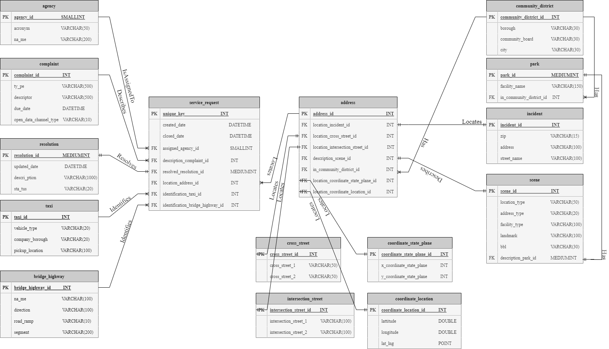
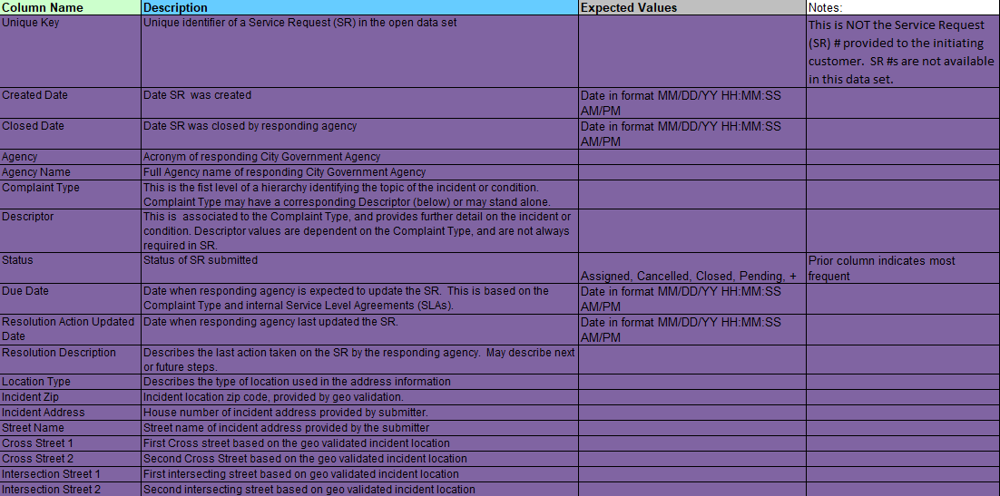
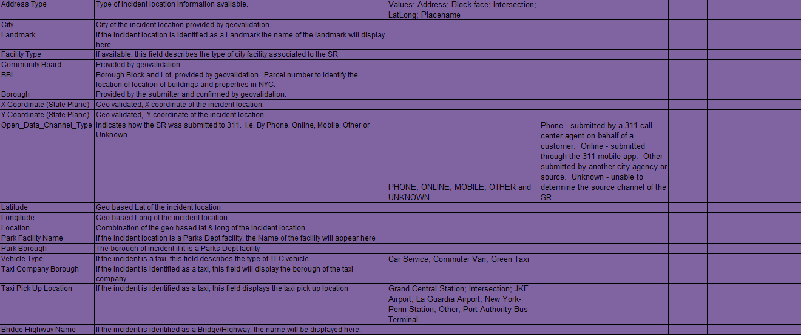

# NYC Open Data 311 Service Requests | Organizing Data
<a name="readme-top"></a>

[![Contributors][contributors-shield]][contributors-url]
[![Forks][forks-shield]][forks-url]
[![Stargazers][stars-shield]][stars-url]
[![Issues][issues-shield]][issues-url]
[![MIT License][license-shield]][license-url]
[![LinkedIn][linkedin-shield]][linkedin-url]
[![GitHub][github-shield]][github-url]

<br />
<div align="center">
  

  

<h3 align="center"><a href="https://data.cityofnewyork.us/Social-Services/311-Service-Requests-from-2010-to-Present/erm2-nwe9">NYC Open Data 311 Service Requests</a></h3>
  <p align="center">
    This project illustrates how to <b>separate and organize an unorganized substantial dataset from NYC Open Data</b>. The dataset that this project focuses on is called <b>"311 Service Requests from 2010 to Present."</b> This dataset is owned by the NYC OpenData and it is provided by the Department of Information Technology & Telecommunications (DoITT). This dataset was first created on October 10, 2011, and is updated daily. This is a huge dataset and until March 20, 2022, had a total of <b>28,28,717 rows</b> where each row represents a 311 Service Request. The number of rows increases every day and as a result, there is a huge need to organize this dataset as it has already become meaningless, ambiguous, and it is extremely difficult to study and retrieve data. The dataset has <b>41 columns</b> and it is constant number meaning that the number of columns neither increasing nor decreasing over the years.
    <br />
    <a href="https://github.com/GeorgiosIoannouCoder/nyc-open-data-311-service-requests"><strong>Explore the docs »</strong></a>
    <br />
    <br />
    <a href="https://github.com/GeorgiosIoannouCoder/nyc-open-data-311-service-requests/issues">Report Bug</a>
    ·
    <a href="https://github.com/GeorgiosIoannouCoder/nyc-open-data-311-service-requests/issues">Request Feature</a>
  </p>
</div>

<details>
  <summary>Table of Contents</summary>
  <ol>
    <li>
      <a href="#about-the-project">About The Project</a>
      <ul>
        <li><a href="#dataset">Dataset</a></li>
        <li><a href="#key-features">Key Features</a></li>
        <li><a href="#built-with">Built With</a></li>
      </ul>
    </li>
    <li>
      <a href="#getting-started">Getting Started</a>
      <ul>
        <li><a href="#prerequisites">Prerequisites</a></li>
        <li><a href="#installation">Installation</a></li>
      </ul>
    </li>
    <li><a href="#er-diagram">ER-Diagram</a></li>
    <li><a href="#code">Code</a></li>
    <li><a href="#data-dictionary">Data Dictionary</a></li>
    <li><a href="#report">Report</a></li>
    <li><a href="#contributing">Contributing</a></li>
    <li><a href="#license">License</a></li>
    <li><a href="#contact">Contact</a></li>
  </ol>
</details>

## About The Project

 

### Dataset

1. The link to the NYC Open Data 311 Service Requests datset is [here](https://data.cityofnewyork.us/Social-Services/311-Service-Requests-from-2010-to-Present/erm2-nwe9).
2. The dataset has:
   1. 1 Table (as of March 20, 2022)
   2. 28,28,717 rows (as of March 20, 2022)
   3. 41 columns (as of March 20, 2022)

### Key Features

1. **Normalize the NYC Open Data 311 Service Requests dataset using third normal form.**
2. **Make it as easy as possible for users to efficiently study, search, and retrieve the NYC Open Data 311 Service Requests dataset.**


<p align="right"><a href="#readme-top">Back to top</a></p>

### Built With

[![SQL][SQL]][SQL-url]
[![MySQL][MySQL]][MySQL-url]
[![Git][Git]][Git-url]

<p align="right"><a href="#readme-top">Back to top</a></p>

## Getting Started

**To get a local copy of NYC Open Data 311 Service Requests up and running locally follow these simple example steps:**

### Prerequisites

1. [MySQL Server (To execute SQL queries)](https://dev.mysql.com/downloads/mysql/).
2. [MySQL Workbench (The official graphical user interface too for MySQL)](https://dev.mysql.com/downloads/workbench/).
3. [The two provided SQL files (The two SQL queries produce the unorganized and organized datasets)](https://github.com/GeorgiosIoannouCoder/nyc-open-data-311-service-requests/tree/main/code).
4. [The provided CSV file(A portion of the original dataset used to import data to the database. You can also go ahead and download the original dataset of size 20GB (as of March 20, 2022))](https://github.com/GeorgiosIoannouCoder/nyc-open-data-311-service-requests/blob/main/GEORGIOS_IOANNOU_Project_1.csv).
   1. Link to the original dataset can be found [here](https://data.cityofnewyork.us/Social-Services/311-Service-Requests-from-2010-to-Present/erm2-nwe9).
   
### Installation

#### Note:

1. [GEORGIOS_IOANNOU_Project_1_Original.sql](https://github.com/GeorgiosIoannouCoder/nyc-open-data-311-service-requests/blob/main/code/GEORGIOS_IOANNOU_Project_1_Original.sql) is the SQL file that creates ***only*** one table for the dataset just like  how it is given [here](https://data.cityofnewyork.us/Social-Services/311-Service-Requests-from-2010-to-Present/erm2-nwe9).

2. [GEORGIOS_IOANNOU_Project_1_Organized.sql](https://github.com/GeorgiosIoannouCoder/nyc-open-data-311-service-requests/blob/main/code/GEORGIOS_IOANNOU_Project_1_Organized.sql) is the SQL file that organizes the dataset and created the database according to the ER-Diagram found [here](https://github.com/GeorgiosIoannouCoder/nyc-open-data-311-service-requests/blob/main/GEORGIOS_IOANNOU_Project_1.png).

#### SetUp

1. Download the two provided SQL files and the CSV file.
2. Open MySQL Workbench and connect to your MySQL Server Connection using your password.
3. In the Query 1 file, execute the following statement:
    ```
    SHOW VARIABLES LIKE "secure_file_priv";
    ``````
    This statement will display a table as seen in Image 1 in the [Report](https://github.com/GeorgiosIoannouCoder/nyc-open-data-311-service-requests/blob/main/report/GEORGIOS_IOANNOU_Project_1_Report.pdf). Navigate to the folder specified in the Value column. For instance, Image 1 instructs us to navigate to the folder ***'C:\ProgramData\MySQL\MySQL Server 8.0\Uploads\'***

4. Drag and drop the provided CSV that you downloaded in Step 1 to the folder indicated by the Value column as described in Step 3.
5. Open the SQL file named **"GEORGIOS_IOANNOU_Project_1_Original"**.
6. Go to line 58 of the SQL file that was opened in Step 5. This is the LOAD DATA INFILE statement. Change the file path of line 58 to match the full file path of the CSV file which you changed its location in Step 4. Make sure that the file path in line 58 uses only forward slashes and not backslashes. For example, this is NOT allowed ***'C:\ProgramData\MySQL\MySQL Server 8.0\Uploads\GEORGIOS_IOANNOU_Project_1.csv'***.
7. Execute the current SQL file.
8. If you get the error shown in Image 2 in the [Report](https://github.com/GeorgiosIoannouCoder/nyc-open-data-311-service-requests/blob/main/report/GEORGIOS_IOANNOU_Project_1_Report.pdf), then you have inserted the CSV file in the wrong folder. Please go back to Step 3 and follow the instructions carefully. If the execution was successful, then a new database and a new table will be created. Moreover, the table will be displayed on your screen. This is the unorganized dataset as provided in the NYC Open Data.
9. Open the SQL file named **"GEORGIOS_IOANNOU_Project_1_Organized"**.
10. Execute the current SQL file.
11. This SQL file will create a new database and new tables as illustrated by the ER-Diagram in Image 3 [Report](https://github.com/GeorgiosIoannouCoder/nyc-open-data-311-service-requests/blob/main/report/GEORGIOS_IOANNOU_Project_1_Report.pdf). In addition to this, the SQL file will display all tables with their rows on your screen. You must expect 15 tables to display on your screen.
   
<p align="right"><a href="#readme-top">Back to top</a></p>

## ER-Diagram

**This is the ER-Diagram that I created to normalize the data in third normal form and thus organize the dataset. I created 15 tables from the 1 table that was given in the original dataset.**




<p align="right"><a href="#readme-top">Back to top</a></p>

## Code

The main code files that include the SQL queries can be found [here](https://github.com/GeorgiosIoannouCoder/nyc-open-data-311-service-requests/tree/main/code).

<p align="right"><a href="#readme-top">Back to top</a></p>

## Data Dictionary

The data dictionary can be found [here](https://github.com/GeorgiosIoannouCoder/nyc-open-data-311-service-requests/blob/main/data_dictionary/311_SR_Data_Dictionary_2018.xlsx) and below.






<p align="right"><a href="#readme-top">Back to top</a></p>

## Report

The project report that explains how I separated/organized the dataset into their tables and relationships, the ER-diagram, and instructions to repoduce the results can be found [here](https://github.com/GeorgiosIoannouCoder/nyc-open-data-311-service-requests/blob/main/report/GEORGIOS_IOANNOU_Project_1_Report.pdf).

<p align="right"><a href="#readme-top">Back to top</a></p>


## Contributing

Contributions are what make the open source community such an amazing place to learn, inspire, and create. Any contributions you make are **greatly appreciated**.

If you have a suggestion that would make this better, please fork the repo and create a pull request. You can also simply open an issue with the tag "enhancement".
Don't forget to give the project a star! Thanks again!

1. Fork the Project
2. Create your Feature Branch (`git checkout -b feature/AmazingFeature`)
3. Commit your Changes (`git commit -m 'Add some AmazingFeature'`)
4. Push to the Branch (`git push origin feature/AmazingFeature`)
5. Open a Pull Request

<p align="right"><a href="#readme-top">Back to top</a></p>

## License

Distributed under the MIT License. See [LICENSE](https://github.com/GeorgiosIoannouCoder/nyc-open-data-311-service-requests/blob/master/LICENSE) for more information.

MIT License

Copyright (c) 2022 Georgios Ioannou

Permission is hereby granted, free of charge, to any person obtaining a copy
of this software and associated documentation files (the "Software"), to deal
in the Software without restriction, including without limitation the rights
to use, copy, modify, merge, publish, distribute, sublicense, and/or sell
copies of the Software, and to permit persons to whom the Software is
furnished to do so, subject to the following conditions:

The above copyright notice and this permission notice shall be included in all
copies or substantial portions of the Software.

THE SOFTWARE IS PROVIDED "AS IS", WITHOUT WARRANTY OF ANY KIND, EXPRESS OR
IMPLIED, INCLUDING BUT NOT LIMITED TO THE WARRANTIES OF MERCHANTABILITY,
FITNESS FOR A PARTICULAR PURPOSE AND NONINFRINGEMENT. IN NO EVENT SHALL THE
AUTHORS OR COPYRIGHT HOLDERS BE LIABLE FOR ANY CLAIM, DAMAGES OR OTHER
LIABILITY, WHETHER IN AN ACTION OF CONTRACT, TORT OR OTHERWISE, ARISING FROM,
OUT OF OR IN CONNECTION WITH THE SOFTWARE OR THE USE OR OTHER DEALINGS IN THE
SOFTWARE.

<p align="right"><a href="#readme-top">Back to top</a></p>

## Contact

Georgios Ioannou - [@LinkedIn](https://linkedin.com/in/georgiosioannoucoder)

Georgios Ioannou - [@georgiosioannoucoder](https://georgiosioannoucoder.github.io/) - Please contact me via the form in my portfolio.

Project Link: [https://github.com/GeorgiosIoannouCoder/nyc-open-data-311-service-requests](https://github.com/GeorgiosIoannouCoder/nyc-open-data-311-service-requests)

<p align="right"><a href="#readme-top">Back to top</a></p>

[contributors-shield]: https://img.shields.io/github/contributors/GeorgiosIoannouCoder/nyc-open-data-311-service-requests.svg?style=for-the-badge
[contributors-url]: https://github.com/GeorgiosIoannouCoder/nyc-open-data-311-service-requests/graphs/contributors

[forks-shield]: https://img.shields.io/github/forks/GeorgiosIoannouCoder/nyc-open-data-311-service-requests.svg?style=for-the-badge
[forks-url]: https://github.com/GeorgiosIoannouCoder/nyc-open-data-311-service-requests/network/members

[stars-shield]: https://img.shields.io/github/stars/GeorgiosIoannouCoder/nyc-open-data-311-service-requests.svg?style=for-the-badge
[stars-url]: https://github.com/GeorgiosIoannouCoder/nyc-open-data-311-service-requests/stargazers

[issues-shield]: https://img.shields.io/github/issues/GeorgiosIoannouCoder/nyc-open-data-311-service-requests.svg?style=for-the-badge
[issues-url]: https://github.com/GeorgiosIoannouCoder/nyc-open-data-311-service-requests/issues

[license-shield]: https://img.shields.io/github/license/GeorgiosIoannouCoder/nyc-open-data-311-service-requests.svg?style=for-the-badge
[license-url]: https://github.com/GeorgiosIoannouCoder/nyc-open-data-311-service-requests/blob/master/LICENSE

[linkedin-shield]: https://img.shields.io/badge/-LinkedIn-black.svg?style=for-the-badge&logo=linkedin&colorB=0077B5
[linkedin-url]: https://linkedin.com/in/georgiosioannoucoder

[github-shield]: https://img.shields.io/badge/-GitHub-black.svg?style=for-the-badge&logo=github&colorB=000
[github-url]: https://github.com/GeorgiosIoannouCoder/

[SQL]: https://img.shields.io/badge/sql-000000?style=for-the-badge&logo=sql&logoColor=ffffff
[SQL-url]: https://aws.amazon.com/what-is/sql/

[MySQL]: https://img.shields.io/badge/mysql-f29111?style=for-the-badge&logo=mysql&logoColor=
[MySQL-url]: https://www.mysql.com/

[Git]: https://img.shields.io/badge/git-000000?style=for-the-badge&logo=git&logoColor=orange
[Git-url]: https://git-scm.com/